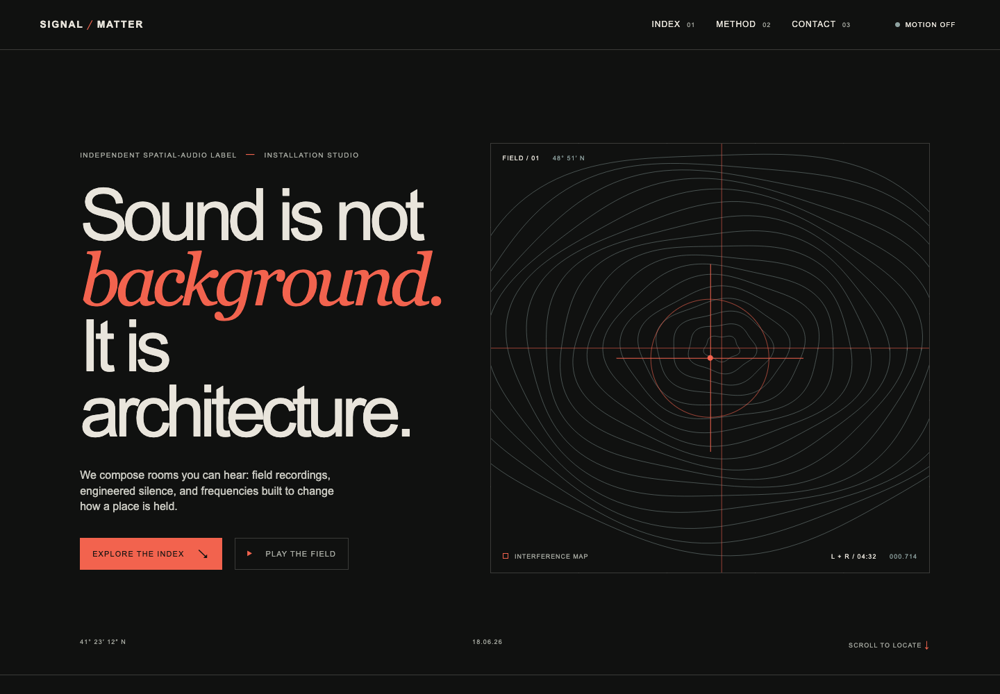
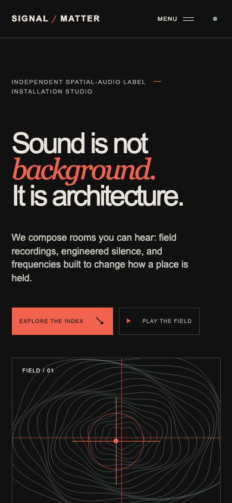
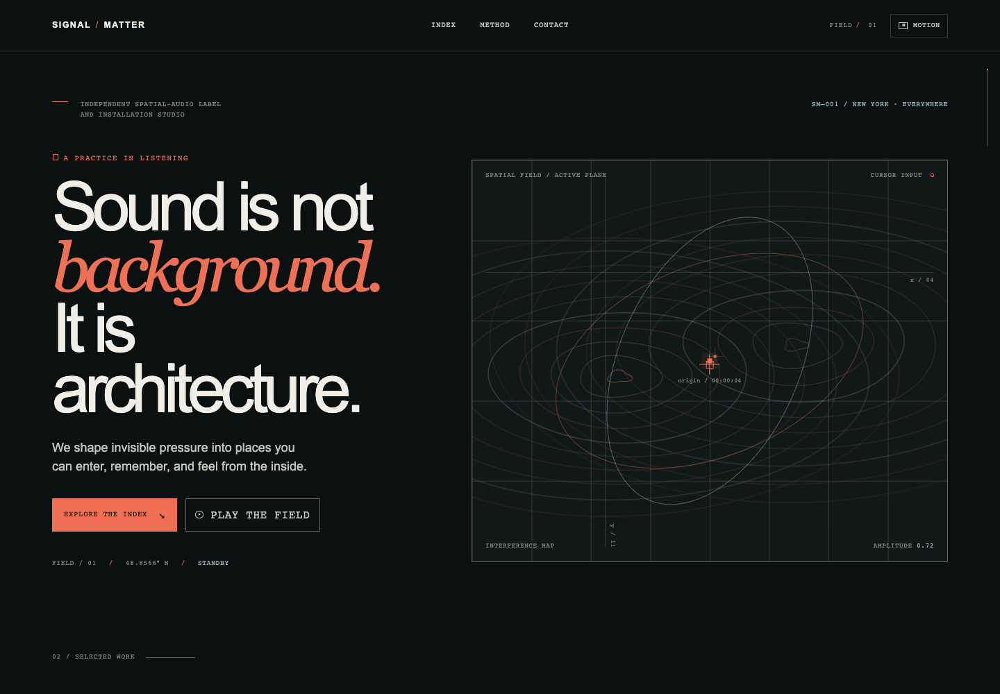
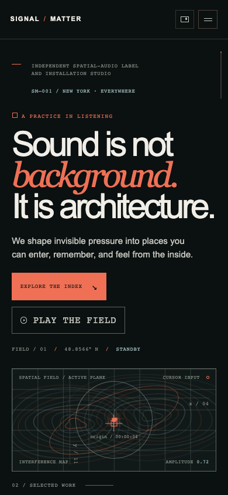

# Measured Run: Signal / Matter

## Status

- Date: 2026-07-10
- Type: paired workflow benchmark with rendered browser evidence
- Task: the fixed Signal / Matter prompt in [`PROMPT.md`](PROMPT.md)
- Repository source commit: `e7d28401d936055a34dbd6c22a54d308a6e99fed`
- Model reported by Codex CLI: `gpt-5.6-luna`
- Output constraint: exactly `index.html`, `styles.css`, and `script.js`
- Network assets: none
- OpenAI evaluation or endorsement: none

## Conditions

Both runs used the same prompt, model, three-file output constraint, and empty starting directory. The baseline used an isolated `CODEX_HOME` with no installed skills or repository skill source. The skill-assisted condition could read the public-core website skills and included a rendered QA pass guided by those skills.

The assisted workflow's browser pass found and corrected two issues before final capture: a missing favicon request and a first-viewport cue that was too low at 900px and 390px. Those corrections are part of the measured assisted workflow and are disclosed rather than treated as one-shot model output.

## Scores

Scores use the 1-5 rubric in [`BENCHMARKS.md`](../../../../../BENCHMARKS.md). They are a repository-maintainer assessment of one paired task, not a statistically powered study.

| Category | Baseline | Skill-assisted | Change | Evidence note |
|---|---:|---:|---:|---|
| Visual direction | 4/5 | 5/5 | +1 | Both are coherent; the assisted result has a more layered field, stronger technical notation, and more differentiated visual states. |
| Content quality | 4/5 | 4/5 | 0 | Both use specific original copy, complete information architecture, and no unsupported proof claims. |
| Frontend implementation | 4/5 | 5/5 | +1 | Both are responsive; the assisted result has clearer component structure, richer state hooks, and a stronger no-JavaScript visual fallback. |
| Motion and interaction | 4/5 | 5/5 | +1 | Both implement the requested controls; the assisted field has more visual variation and more descriptive accessible state language. |
| Accessibility | 4/5 | 5/5 | +1 | Both pass the tested controls and reduced-motion checks; the assisted result has more explicit status and descriptive labeling. |
| QA and handoff | 3/5 | 4/5 | +1 | Both received the same external Chromium pass; the assisted workflow also closed its discovered fold and favicon issues before capture. |
| **Total** | **23/30** | **28/30** | **+5** | **Skill-assisted result is 93.3% vs 76.7% on this rubric.** |

## Rendered Evidence

| Condition | Desktop | Mobile |
|---|---|---|
| Baseline |  |  |
| Skill-assisted |  |  |

The raw browser result is saved at [`qa/results.json`](qa/results.json).

## Observed Differences

- Neither condition overflowed horizontally at 1440px, 1280px, 900px, or 390px.
- Both canvases rendered nonblank sampled pixels at every viewport.
- Both mobile menus opened, reported `aria-expanded="true"`, and closed with Escape.
- Both motion controls updated `aria-pressed`; both reduced-motion runs kept reveal content visible.
- The baseline's next section began below the 390px viewport at approximately 963px.
- The assisted next-section cue began within the 390px viewport at approximately 804px.
- The baseline emitted one missing-favicon 404 on its first desktop load; the final assisted result had no console errors or failed requests.

## Limitations

- This is one prompt and one run per condition.
- Scoring includes human visual judgment and was performed by the repository maintainer workflow.
- Browser automation used Brave's Chromium engine on one machine; Safari and Firefox were not tested.
- No Lighthouse or laboratory performance score is claimed.
- The benchmark supports a task-specific workflow improvement, not a universal causal claim for all prompts or models.

## Reference Boundary

The prompt was informed by general patterns observed in contemporary motion and portfolio galleries, including MotionSites, Landing Love, and selected Awwwards portfolio pages. No source site's branding, assets, code, or exact layout was copied. The test brand, copy, composition, canvas field, and implementation are original.
